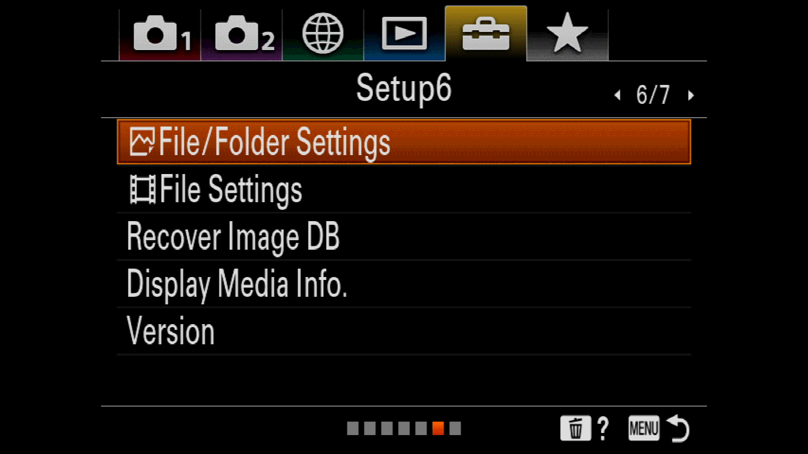
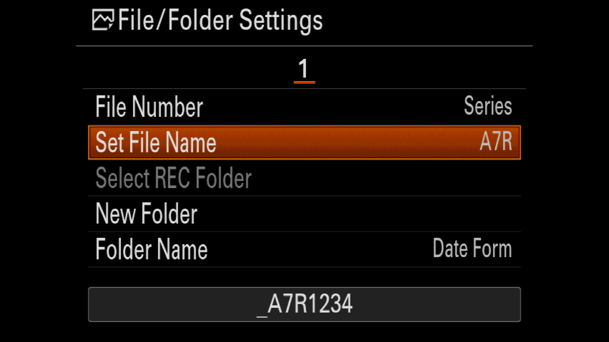

# Disclaimer: Early work-in progress


# About

Sony cameras have the functionality to save/load special settings files --  called "Camset" (**Cam**era **Set**ings) files.

This tool is a parser for those Camset files. The goal of the project is to allow you to analyze Camset files so you can see exactly see what settings you saved with. (Eventually I'll add support for _creating_ Camset files)

# Setup/Installation

There's 2 versions of this so far, one is a C++ and one is a Rust application. I'm planning on only supporting and developing the Rust version for now, but the C++ version might be used in environments where you don't have access to a Rust compiler.

## Rust

To build the **Rust** version:

```bash
$ cargo build
```

Once run, you should see something like:

```
Camera Make: SONY
Camera Model: ILCE-7RM4
File created on date: 20220906_13195
Camset Name: CAMSET01.DAT
Saved image filename prefix: A7R
```

## C++ version (Legacy)

The C++ version uses CMake:

```bash
$ cmake CMakeLists.txt
$ make
```

Once run, you would see:

```
Camera model is = SONYILCE-7RM4
File name is: CAMSET01.DAT
File created date: 20190712_0839
---
Image sequence prefix filename: DSC
```

# Features supported

Like I said before, this is an early work-in-progress. So far only one actual setting feature is supported.

| Menu Location | Setting Name                          | Model supported on     | Screenshots                                                                                                                                           |
|---------------|---------------------------------------|------------------------|-------------------------------------------------------------------------------------------------------------------------------------------------------|
| Setup6        | File/Folder Settings -> Set File Name | ILCE-7RM4 (A7RIV), ILCE-9M2 (Alpha a9)|    |
|               |                                       |                        |                                                                                                                                                       |
|               |                                       |                        |                                                                                                                                                       |